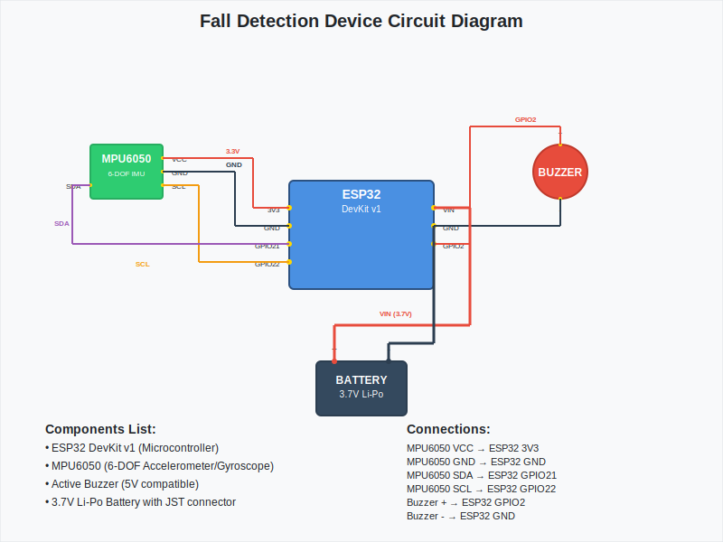
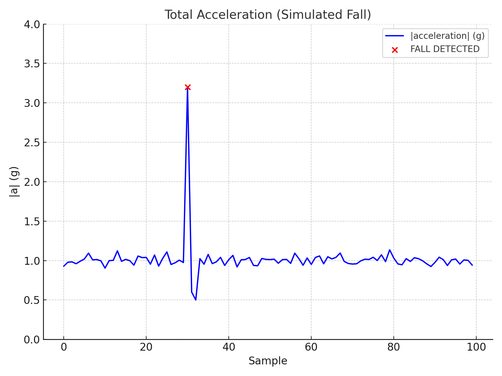

#  FallGuard: Intelligent Fall Detection System

[](https://www.espressif.com/en/products/socs/esp32)
[](https://www.python.org/)
[](https://www.twilio.com/)
[](https://opensource.org/licenses/MIT)

**FallGuard** is a sophisticated IoT safety solution that leverages the **ESP32** microcontroller and **MPU6050** inertial sensor to detect human falls in real-time. By combining edge-processing on the ESP32 with a Python-based monitoring hub, it ensures rapid response and automated emergency notifications.

---

## Key Features

*   **🔍 Multi-Stage Detection**: Algorithm analyzes peak acceleration (impact), post-impact stillness, and body orientation (angle change) for high accuracy.
*   **🌐 Wireless Streaming**: ESP32 operates as a standalone Access Point, streaming raw sensor data via **WebSockets**.
*   **📱 Instant Alerts**: Automated SMS notifications sent via **Twilio** when a fall is verified.
*   **📊 Data Logging**: Real-time logging of acceleration and posture data to CSV for activity analysis and model training.
*   **🚨 Local Feedback**: On-board buzzer provides immediate audible confirmation during a fall event.

---

## 🔧 Hardware Components

| Component       | Quantity | Description                         |
| --------------- | -------- | ----------------------------------- |
| ESP32 Dev Board | 1        | Microcontroller with built-in Wi-Fi |
| MPU6050 Sensor  | 1        | Accelerometer + Gyroscope module    |
| Buzzer          | 1        | Audio alert on fall detection       |
| Breadboard      | 1        | For assembling prototype circuit    |
| Jumper Wires    | ~10      | For connecting components           |
| Micro-USB Cable | 1        | For programming and powering ESP32  |

---

## 🏗️ System Architecture

1.  **Sense**: The MPU6050 captures 3-axis accelerometer and gyroscope data.
2.  **Process**: ESP32 runs firmware to calculate magnitude and detect specific "fall" patterns.
3.  **Transmit**: Alerts and data packets are sent over WebSockets to the Python client.
4.  **Action**: The Python hub triggers the Twilio SMS gateway and saves telemetry to `fall_detection_log.csv`.

---

## 🖼️ Visualizations

### 🔌 Circuit Diagram

*The hardware interface between the ESP32 and MPU6050 sensor.*

### 📈 Fall Detection Graph

*Real-time acceleration magnitude showing the peak during an impact event.*

### 🎥 Project Demonstration

*Watch the system in action: from fall detection to alert triggering.*

---

## 📁 Project Structure

```text
fall detection/
├── code/
│   ├── main.cpp          # ESP32 Firmware (C++/Arduino)
│   └── main.py           # Python Monitoring & SMS Hub
├── data/
│   └── falldata.csv      # Sample motion datasets
├── image/                # System diagrams and motion graphs
├── send/                 # Utility scripts and supplementary code
└── readme.md             # Project documentation
```

---

## 🛠️ Installation & Setup

### 1. Hardware Connections
| MPU6050 | ESP32 | Description |
| :--- | :--- | :--- |
| **VCC** | 3.3V | Power |
| **GND** | GND | Ground |
| **SCL** | GPIO 22 | I2C Clock |
| **SDA** | GPIO 21 | I2C Data |

### 2. Flash the Firmware
*   Open `code/main.cpp` in **VS Code (PlatformIO)** or **Arduino IDE**.
*   Install required libraries: `MPU6050`, `ArduinoJson`, `ESPAsyncWebServer`.
*   Upload to your ESP32.

### 3. Python Environment
Install the necessary dependencies to run the monitoring hub:
```bash
pip install websocket-client pandas twilio
```

### 4. Configuration
Update `code/main.py` with your Twilio credentials:
```python
account_sid = 'YOUR_TWILIO_SID'
auth_token = 'YOUR_TWILIO_AUTH_TOKEN'
twilio_from = '+1XXXXXXXXXX'
twilio_to = '+91XXXXXXXXXX'
```

---

## 🚀 Usage

1.  Power on the ESP32. It will create a Wi-Fi network named `ESP32-FallDetector`.
2.  Connect your computer to this Wi-Fi network (Password: `12345678`).
3.  Run the Python script:
    ```bash
    python code/main.py
    ```
4.  The terminal will display real-time stability metrics. If a fall is detected, an SMS will be dispatched immediately.

---

## 📊 Detection Logic
The system uses the following thresholds to minimize false positives:
*   **Impact**: Acceleration magnitude > **2.5G**
*   **Stillness**: Motion returns to ~1.0G (gravity only) after impact.
*   **Angle**: Body orientation changes by approximately **~90°** from the initial upright position.

---

## 📜 License
Distributed under the **MIT License**. See `LICENSE` for more information.

---
*Created with ❤️ for personal safety and IoT innovation.*
